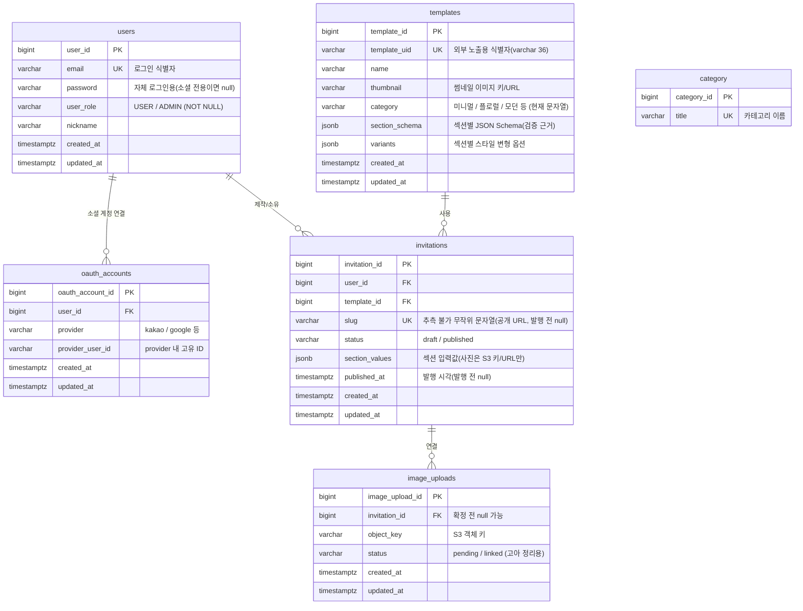

# MiniWed 데이터 모델 (ERD)

> 이 문서는 확정된 문서([ARCHITECTURE.md](./ARCHITECTURE.md), [ADR-001](./adr/ADR-001-image-storage-s3-presigned.md), [ADR-002](./adr/ADR-002-template-schema-jsonschema-jsonb.md), [ADR-003](./adr/ADR-003-authentication-jwt-oauth2.md), [ADR-004](./adr/ADR-004-refresh-token-redis.md), [SA](./SA-service-analysis.md))의 결정을 바탕으로 한 **데이터 모델 문서**입니다.
> 엔티티 구현이 시작되어, 이 문서는 현재 코드(`domain/**/entity`)를 반영합니다.
>
> - 최초 작성일: 2026-07-01
> - 최종 갱신일: 2026-07-13
> - 상태: 구현 반영 (일부 컬럼은 후속 ADR/구현에서 확정)
> - RDB: PostgreSQL (`jsonb` 활용 — ADR-002)
> - **Refresh 토큰은 RDB가 아닌 Redis에 저장한다(ADR-004).** 아래 RDB 스키마에는 포함하지 않는다.

---

## 1. 한눈에 보기 (ER 다이어그램)



> **Redis (RDB 아님):** `RefreshToken` — key `refreshToken:{userId}`, 값 `token_hash`, `@TimeToLive`로 만료 자동 삭제. 사용자당 1세션(ADR-004).
>
> **의도적 비연결:** `category` 테이블이 추가됐지만, `templates.category`는 FK가 아니라 문자열 컬럼으로 두 테이블을 **의도적으로 연결하지 않는다.** 카테고리 값은 템플릿 생성 시점에만 들어오는 정보라 정규화/FK가 불필요하다는 판단(§5 참고).

---

## 2. 엔티티 상세

### 2.1 `users` — 제작자/관리자 계정
근거: ADR-003 (JWT 인증, 소셜+자체 병행, USER/ADMIN 역할). 코드: `domain/user/entity/dto/User`.

| 컬럼 | 타입 | 제약 | 설명 |
|---|---|---|---|
| `user_id` | bigint | PK (IDENTITY) | 내부 식별자 |
| `email` | varchar | UNIQUE, NOT NULL | 로그인 식별자 겸 account linking 키 |
| `password` | varchar | NULL 허용 | 자체 로그인용 해시. **소셜 전용 가입이면 null** |
| `user_role` | varchar(enum) | NOT NULL | `USER` / `ADMIN` (`UserRole`, `@Enumerated(STRING)`). 생성 시 null이면 예외 |
| `nickname` | varchar | | 표시 이름 (잠정) |
| `created_at` / `updated_at` | timestamptz | NOT NULL | `@CreationTimestamp` / `@UpdateTimestamp` |

- 하객은 **계정이 없다.** 무인증 공개 열람이므로 `users`에 하객 개념은 없다. (ADR-003)
- 역할 필드명은 코드상 `userRole`(enum `UserRole`)이며 DB 기본값(default)은 두지 않고 애플리케이션에서 필수로 강제한다.

### 2.2 `oauth_accounts` — 소셜 로그인 연결
근거: ADR-003. 코드: `domain/auth/entity/OauthAccount`.

| 컬럼 | 타입 | 제약 | 설명 |
|---|---|---|---|
| `oauth_account_id` | bigint | PK (IDENTITY) | |
| `user_id` | bigint | FK → users, NOT NULL | 연결된 사용자 (`@ManyToOne LAZY`) |
| `provider` | varchar | NOT NULL | `kakao`, `google` 등 |
| `provider_user_id` | varchar | NOT NULL | provider 내 고유 ID |
| `created_at` / `updated_at` | timestamptz | NOT NULL | `BaseEntity` 공통 (JPA Auditing) |

- `(provider, provider_user_id)`에 UNIQUE 제약(`uk_oauth_provider_user`) 적용.
- 같은 이메일로 소셜/자체 가입이 겹칠 수 있어 `user_id`로 묶어 동일인을 식별한다(account linking 정책은 ADR-003 후속).

### 2.3 `RefreshToken` — refresh 토큰 (Redis 저장)
근거: **ADR-004** (RDB가 아닌 Redis 저장). 코드: `domain/auth/entity/RefreshToken` (`@RedisHash`).

RDB 테이블이 아니라 Redis 해시로 저장한다.

| 필드 | 타입 | 설명 |
|---|---|---|
| `userId` | Long | `@Id` — key `refreshToken:{userId}` (사용자당 1세션) |
| `tokenHash` | String | 토큰 원문이 아닌 해시 |
| `ttlSeconds` | Long | `@TimeToLive` — 만료 시 Redis 키 자동 삭제 |

- access 토큰은 무상태라 저장하지 않는다. refresh 토큰만 저장/회전한다.
- 로그아웃·회전은 **키 삭제**로 처리한다(RDB의 `revoked` 플래그 방식 아님).
- 다중 기기 세션·회전 상세는 ADR-004 후속 과제.

### 2.4 `templates` — 템플릿 메타데이터
근거: ADR-002. 코드: `domain/template/entity/dto/Template`.

| 컬럼 | 타입 | 제약 | 설명 |
|---|---|---|---|
| `template_id` | bigint | PK (IDENTITY) | 내부 PK. **프론트 React 컴포넌트와 매핑되는 키** |
| `template_uid` | varchar(36) | UNIQUE, NOT NULL, 불변 | 외부 노출용 식별자(인덱스 `idx_template_uid`) |
| `name` | varchar | NOT NULL | 템플릿 이름 |
| `thumbnail` | varchar | | 썸네일 키/URL |
| `category` | varchar | | 미니멀 / 플로럴 / 모던 등 (현재 문자열, `category` 테이블과 미연결) |
| `section_schema` | jsonb | NOT NULL | 섹션별 JSON Schema 문서 (서버 검증 근거) |
| `variants` | jsonb | | 섹션별 스타일 변형(색/폰트/순서) 옵션 |
| `created_at` / `updated_at` | timestamptz | NOT NULL | |

- `template_id`는 DB 행이지만 실제 화면은 프론트 컴포넌트다. **DB 등록만으로 완성되지 않으며** 프론트 배포와 동기화가 전제(ARCHITECTURE §6).
- 스키마 **버전 관리는 미도입**(ADR-002).

### 2.5 `category` — 템플릿 카테고리 (신규, 진행 중)
코드: `domain/template/entity/dto/Category`.

| 컬럼 | 타입 | 제약 | 설명 |
|---|---|---|---|
| `category_id` | bigint | PK (IDENTITY) | |
| `title` | varchar | UNIQUE, NOT NULL, 불변 | 카테고리 이름 |

- 카테고리 목록 관리용 테이블이다. **`templates.category`와는 의도적으로 연결하지 않는다**(FK 아님, 문자열 유지). 카테고리는 템플릿 생성 시점에만 들어오는 정보라 정규화가 불필요하다는 판단이다.

### 2.6 `invitations` — 사용자 청첩장
근거: ADR-002, ADR-003. 코드: `domain/invitation/entity/dto/Invitation`.

| 컬럼 | 타입 | 제약 | 설명 |
|---|---|---|---|
| `invitation_id` | bigint | PK (IDENTITY) | |
| `user_id` | bigint | FK → users, NOT NULL | 소유자 (`@ManyToOne LAZY`) |
| `template_id` | bigint | FK → templates, NOT NULL | 선택한 템플릿 (`@ManyToOne LAZY`) |
| `slug` | varchar | UNIQUE, NULL 허용 | **추측 불가 무작위 문자열**. 발행 시 발급 |
| `status` | varchar(enum) | NOT NULL | `InvitationStatus`: `DRAFT` / `PUBLISHED` (기본 DRAFT) |
| `section_values` | jsonb | | 섹션 입력값. 사진은 **S3 키/URL만** (ADR-001) |
| `published_at` | timestamptz | NULL 허용 | 발행 시각 |
| `created_at` / `updated_at` | timestamptz | NOT NULL | |

- `section_values`는 정규화하지 않고 통째로 저장(ADR-002). 예:
  ```json
  {
    "cover":   { "groom_name": "…", "bride_name": "…", "date": "2026-10-10" },
    "greeting":{ "greeting_text": "…" },
    "gallery": { "photos": ["invitations/123/uuid1.jpg", "invitations/123/uuid2.jpg"] },
    "account": { "groom_account": "…", "bride_account": "…" }
  }
  ```
- 저장(write) 시점에 `template.section_schema`로 검증 후 통과분만 저장(ADR-002).
- 공개 조회는 `status = PUBLISHED`인 경우만 노출(ADR-003).

### 2.7 `image_uploads` — 업로드 추적
근거: ADR-001 (고아 객체 정리). 코드: `domain/image/entity/dto/ImageUpload`.

| 컬럼 | 타입 | 제약 | 설명 |
|---|---|---|---|
| `image_upload_id` | bigint | PK (IDENTITY) | |
| `invitation_id` | bigint | FK → invitations, NULL 허용 | 확정 전 미연결 (`@ManyToOne LAZY`) |
| `object_key` | varchar | NOT NULL | S3 객체 키 |
| `status` | varchar(enum) | NOT NULL | `ImageStatus`: `PENDING` / `LINKED` (기본 PENDING) |
| `created_at` / `updated_at` | timestamptz | NOT NULL | `BaseEntity` 공통 (JPA Auditing) |

- 사진 키는 `invitations.section_values` 안에도 들어가지만, ADR-001의 **고아 객체(orphan) 정리**를 위해 발급 키를 추적한다.
- S3 lifecycle 규칙과의 역할 분담은 ADR-001 후속 과제.

---

## 3. 관계 요약

| 관계 | 카디널리티 | 설명 |
|---|---|---|
| users — invitations | 1 : N | 한 사용자가 여러 청첩장을 만든다 |
| templates — invitations | 1 : N | 한 템플릿을 여러 청첩장이 사용한다 |
| users — oauth_accounts | 1 : N | 한 사용자가 여러 소셜을 연결할 수 있다 |
| invitations — image_uploads | 1 : N | 청첩장에 연결된 업로드 이미지 |
| (templates — category) | — | **의도적 비연결.** `templates.category`는 문자열이며 `category` 테이블을 참조하지 않는다(정규화 불필요 판단) |

> refresh 토큰은 Redis에 저장하므로 RDB 관계에 포함하지 않는다(ADR-004).

---

## 4. 설계 근거 / 특이점

- **jsonb 중심 설계**: `templates.section_schema`, `invitations.section_values`를 정규화하지 않고 jsonb로 둔다(ADR-002). Hibernate 네이티브 `@JdbcTypeCode(SqlTypes.JSON)`으로 매핑한다.
- **DB 레벨 무결성이 약함**: jsonb라 필드 NOT NULL/FK를 DB가 보장하지 못한다. **서버 검증을 신뢰하는 것이 전제**(ADR-002).
- **이미지 = 참조만 저장**: 바이너리는 S3, DB에는 키/URL만(ADR-001).
- **하객은 엔티티가 없음**: 무인증 공개 열람이므로 하객용 테이블/계정이 없다(ADR-003).
- **refresh 토큰은 Redis**: TTL 자동 만료·빠른 조회를 위해 RDB가 아닌 Redis에 저장(ADR-004).
- **공통 타임스탬프**: 모든 RDB 엔티티는 `BaseEntity`(`@MappedSuperclass`)를 상속해 `created_at`/`updated_at`을 공유하며, 값은 JPA Auditing(`@EnableJpaAuditing`, `@CreatedDate`/`@LastModifiedDate`)으로 채운다. `Category`는 타임스탬프가 없어 상속하지 않고, `RefreshToken`은 Redis라 해당 없음.

## 5. 미확정 / 진행 중 과제

| 주제 | 메모 | 관련 |
|---|---|---|
| refresh 토큰 저장소 | **확정: Redis(ADR-004)**. 회전·다중 세션 상세는 후속 | ADR-004 |
| category 정규화 | **결정: 비정규화 유지.** `Category`는 목록 관리용 별도 테이블, `templates.category`는 문자열로 두고 FK로 연결하지 않음 | ADR-002 |
| account linking | 동일 이메일 소셜/자체 겹칠 때 병합 정책 | ADR-003 |
| 슬러그 생성 규칙 | 길이·문자셋·충돌 처리 | ADR-003 |
| 스키마 버전 관리 | 미도입 — 변경 시 기존 데이터 호환 | ADR-002 |
| 고아 이미지 정리 | image_uploads 기반 정리 vs S3 lifecycle 역할 분담 | ADR-001 |

## 6. 참고
- [ARCHITECTURE.md](./ARCHITECTURE.md), [SA-service-analysis.md](./SA-service-analysis.md)
- [ADR-001](./adr/ADR-001-image-storage-s3-presigned.md) · [ADR-002](./adr/ADR-002-template-schema-jsonschema-jsonb.md) · [ADR-003](./adr/ADR-003-authentication-jwt-oauth2.md) · [ADR-004](./adr/ADR-004-refresh-token-redis.md)
- [API-SPEC.md](./API-SPEC.md) — 본 데이터 모델을 노출하는 REST API 명세
