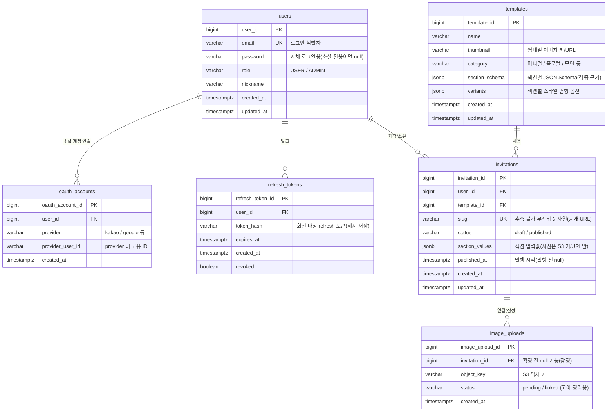

# MiniWed 데이터 모델 (ERD)

> 이 문서는 지금까지 확정된 문서([ARCHITECTURE.md](./ARCHITECTURE.md), [ADR-001](./adr/ADR-001-image-storage-s3-presigned.md), [ADR-002](./adr/ADR-002-template-schema-jsonschema-jsonb.md), [ADR-003](./adr/ADR-003-authentication-jwt-oauth2.md), [SA](./SA-service-analysis.md))의 결정을 바탕으로 **데이터 모델을 도출한 문서**입니다.
> 아직 엔티티 코드는 없으며(현재 `ServerApplication`만 존재), 여기 스키마는 구현 착수 전 **설계안(잠정)**입니다.
>
> - 최초 작성일: 2026-07-01
> - 상태: 초안 (일부 컬럼은 후속 ADR/구현에서 확정)
> - DB: PostgreSQL (`jsonb` 활용 — ADR-002)

---

## 1. 한눈에 보기 (ER 다이어그램)



---

## 2. 엔티티 상세

### 2.1 `users` — 제작자/관리자 계정
근거: ADR-003 (JWT 인증, 소셜+자체 병행, USER/ADMIN 역할).

| 컬럼 | 타입 | 제약 | 설명 |
|---|---|---|---|
| `user_id` | bigint | PK | 내부 식별자 |
| `email` | varchar | UNIQUE, NOT NULL | 로그인 식별자 겸 account linking 키 |
| `password` | varchar | NULL 허용 | 자체 로그인용 해시. **소셜 전용 가입이면 null** |
| `role` | varchar | NOT NULL, default `USER` | `USER` / `ADMIN` |
| `nickname` | varchar | | 표시 이름 (잠정) |
| `created_at` / `updated_at` | timestamptz | NOT NULL | |

- 하객은 **계정이 없다.** 무인증 공개 열람이므로 `users`에 하객 개념은 없다. (ADR-003)
- ADMIN은 초기 시드/수동 지정 예정(부여 방식은 ADR-003 후속 과제).

### 2.2 `oauth_accounts` — 소셜 로그인 연결
근거: ADR-003 (OAuth2 소셜 로그인, account linking 필요).

| 컬럼 | 타입 | 제약 | 설명 |
|---|---|---|---|
| `oauth_account_id` | bigint | PK | |
| `user_id` | bigint | FK → users | 연결된 사용자 |
| `provider` | varchar | NOT NULL | `kakao`, `google` 등 |
| `provider_user_id` | varchar | NOT NULL | provider 내 고유 ID |
| `created_at` | timestamptz | NOT NULL | |

- `(provider, provider_user_id)` 조합에 UNIQUE 권장.
- 같은 이메일로 소셜/자체 가입이 겹칠 수 있어 `user_id`로 묶어 동일인을 식별한다(account linking 정책은 ADR-003 후속).

### 2.3 `refresh_tokens` — refresh 토큰 저장/회전
근거: ADR-003 (access+refresh 구조, 무효화·회전 보완 필요).

| 컬럼 | 타입 | 제약 | 설명 |
|---|---|---|---|
| `refresh_token_id` | bigint | PK | |
| `user_id` | bigint | FK → users | |
| `token_hash` | varchar | NOT NULL | 토큰 원문이 아닌 해시 저장 |
| `expires_at` | timestamptz | NOT NULL | 만료 시각 |
| `revoked` | boolean | NOT NULL, default false | 로그아웃/회전 시 무효화 |
| `created_at` | timestamptz | NOT NULL | |

- access 토큰은 무상태라 저장하지 않는다. refresh 토큰만 회전/무효화를 위해 저장.
- 저장 방식(DB vs Redis 등)·회전 상세는 ADR-003 후속 과제. 여기서는 RDB 안을 잠정 제시.

### 2.4 `templates` — 템플릿 메타데이터
근거: ADR-002 (JSON Schema를 `section_schema` jsonb로 저장), ARCHITECTURE §5.

| 컬럼 | 타입 | 제약 | 설명 |
|---|---|---|---|
| `template_id` | bigint | PK | **프론트 React 컴포넌트와 매핑되는 키** |
| `name` | varchar | NOT NULL | 템플릿 이름 |
| `thumbnail` | varchar | | 썸네일 키/URL |
| `category` | varchar | | 미니멀 / 플로럴 / 모던 등 |
| `section_schema` | jsonb | NOT NULL | 섹션별 JSON Schema 문서 (서버 검증 근거) |
| `variants` | jsonb | | 섹션별 스타일 변형(색/폰트/순서) 옵션 |
| `created_at` / `updated_at` | timestamptz | NOT NULL | |

- `template_id`는 DB 행이지만 실제 화면은 프론트 컴포넌트다. **DB 등록만으로 완성되지 않으며** 프론트 배포와 동기화가 전제(ARCHITECTURE §6).
- 스키마 **버전 관리는 미도입**(ADR-002). 운영 중 스키마 변경 시 기존 청첩장과 어긋날 수 있음 → 후속 과제.

### 2.5 `invitations` — 사용자 청첩장
근거: ADR-002 (`section_values` jsonb), ADR-003 (무작위 slug, draft/published), ARCHITECTURE §5.

| 컬럼 | 타입 | 제약 | 설명 |
|---|---|---|---|
| `invitation_id` | bigint | PK | |
| `user_id` | bigint | FK → users, NOT NULL | 소유자 |
| `template_id` | bigint | FK → templates, NOT NULL | 선택한 템플릿 |
| `slug` | varchar | UNIQUE | **추측 불가 무작위 문자열**. 발행 시 발급 |
| `status` | varchar | NOT NULL, default `draft` | `draft` / `published` |
| `section_values` | jsonb | | 섹션 입력값. 사진은 **S3 키/URL만** (ADR-001) |
| `published_at` | timestamptz | NULL 허용 | 발행 시각 |
| `created_at` / `updated_at` | timestamptz | NOT NULL | |

- `section_values`는 정규화하지 않고 통째로 저장(ADR-002). 예:
  ```json
  {
    "cover":   { "groom_name": "…", "bride_name": "…", "date": "2026-10-10" },
    "greeting":{ "greeting_text": "…" },
    "gallery": { "photos": ["invitations/123/uuid1.jpg", "invitations/123/uuid2.jpg"] },
    "account": { "groom_account": "…", "bride_account": "…" }
  }
  ```
- 저장(write) 시점에 `template.section_schema`로 검증 후 통과분만 저장(ADR-002).
- 공개 조회는 `status = published`인 경우만 노출(ADR-003).

### 2.6 `image_uploads` — 업로드 추적 (잠정, 후속)
근거: ADR-001 (고아 객체 정리, 임시→확정 경로/연결 정책 필요 — 후속 과제).

| 컬럼 | 타입 | 제약 | 설명 |
|---|---|---|---|
| `image_upload_id` | bigint | PK | |
| `invitation_id` | bigint | FK → invitations, NULL 허용 | 확정 전 미연결 |
| `object_key` | varchar | NOT NULL | S3 객체 키 |
| `status` | varchar | NOT NULL | `pending` / `linked` |
| `created_at` | timestamptz | NOT NULL | |

- **이 테이블은 필수가 아니다.** 사진 키는 `invitations.section_values` 안에 들어가므로, 최소 구현에는 별도 테이블 없이도 동작한다.
- 다만 ADR-001의 **고아 객체(orphan) 정리**를 DB 기반으로 하려면 발급된 키를 추적할 필요가 있어 후보로 둔다. S3 lifecycle 규칙만으로 정리한다면 이 테이블은 생략 가능. 정책 확정은 ADR-001 후속 과제.

---

## 3. 관계 요약

| 관계 | 카디널리티 | 설명 |
|---|---|---|
| users — invitations | 1 : N | 한 사용자가 여러 청첩장을 만든다 |
| templates — invitations | 1 : N | 한 템플릿을 여러 청첩장이 사용한다 |
| users — oauth_accounts | 1 : N | 한 사용자가 여러 소셜을 연결할 수 있다 |
| users — refresh_tokens | 1 : N | 기기/세션별 refresh 토큰 |
| invitations — image_uploads | 1 : N | (잠정) 청첩장에 연결된 업로드 이미지 |

---

## 4. 설계 근거 / 특이점

- **jsonb 중심 설계**: `templates.section_schema`, `invitations.section_values`를 정규화하지 않고 jsonb로 둔다. 템플릿마다 필드가 가변이고 청첩장은 통째로 읽기 때문(ADR-002).
- **DB 레벨 무결성이 약함**: jsonb라 필드 NOT NULL/FK를 DB가 보장하지 못한다. **서버 검증을 신뢰하는 것이 전제**(ADR-002).
- **이미지 = 참조만 저장**: 바이너리는 S3, DB에는 키/URL만(ADR-001).
- **하객은 엔티티가 없음**: 무인증 공개 열람이므로 하객용 테이블/계정이 없다(ADR-003).

## 5. 미확정 / 후속 과제

| 주제 | 메모 | 관련 |
|---|---|---|
| refresh 토큰 저장소 | RDB vs Redis, 회전 상세 | ADR-003 |
| account linking | 동일 이메일 소셜/자체 겹칠 때 병합 정책 | ADR-003 |
| 슬러그 생성 규칙 | 길이·문자셋·충돌 처리 | ADR-003 |
| 스키마 버전 관리 | 미도입 — 변경 시 기존 데이터 호환 | ADR-002 |
| 고아 이미지 정리 | image_uploads 테이블 채택 여부 / S3 lifecycle | ADR-001 |
| jsonb JPA 매핑 | Hibernate 매핑 방식 결정 | ADR-002 |

## 6. 참고
- [ARCHITECTURE.md](./ARCHITECTURE.md), [SA-service-analysis.md](./SA-service-analysis.md)
- [ADR-001](./adr/ADR-001-image-storage-s3-presigned.md) · [ADR-002](./adr/ADR-002-template-schema-jsonschema-jsonb.md) · [ADR-003](./adr/ADR-003-authentication-jwt-oauth2.md)
- [API-SPEC.md](./API-SPEC.md) — 본 데이터 모델을 노출하는 REST API 명세
